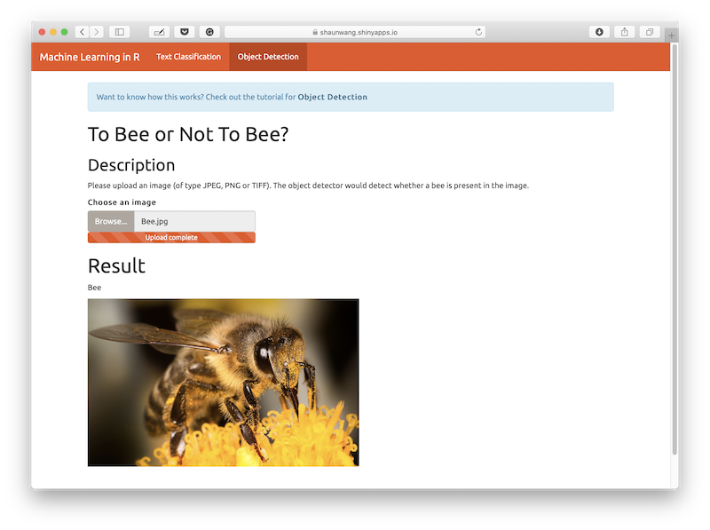
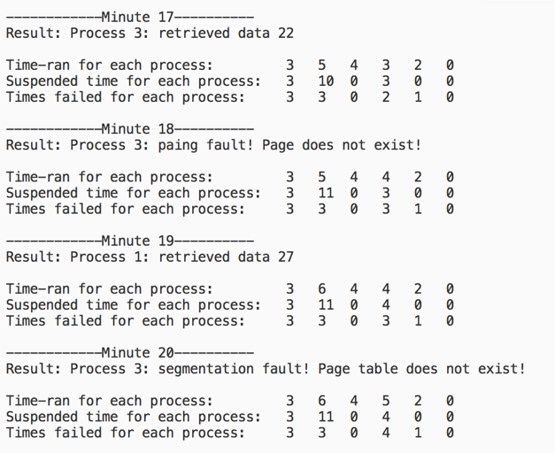
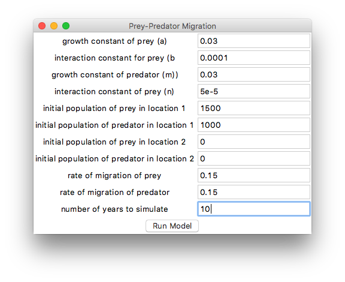
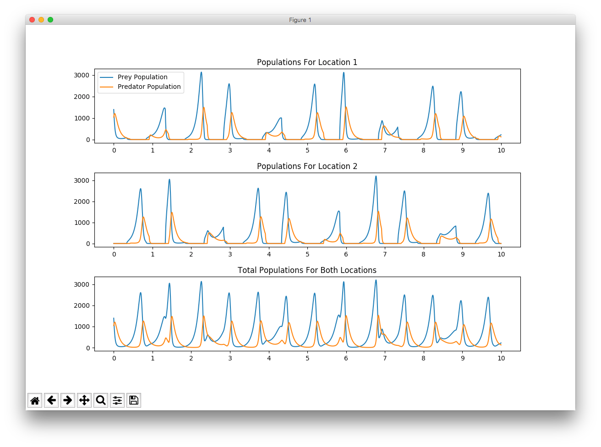
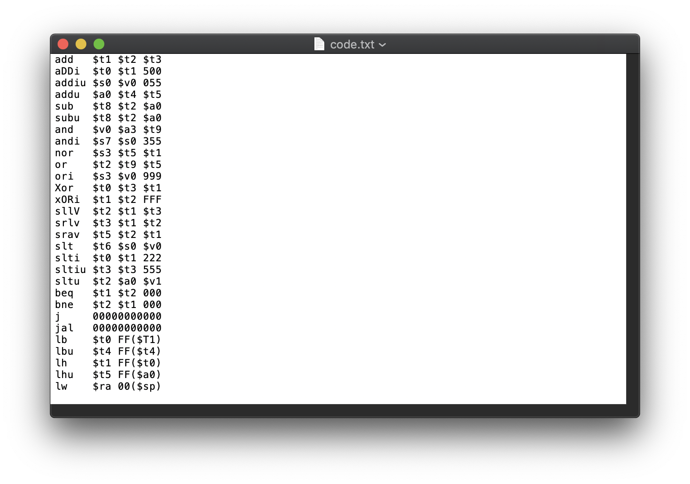
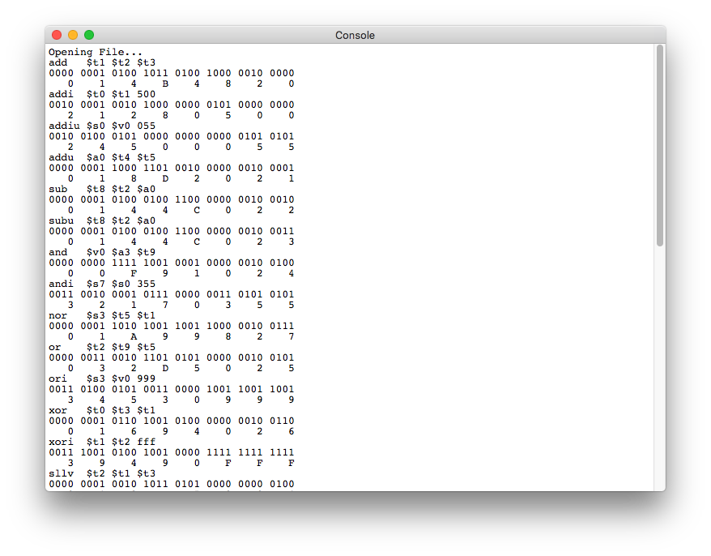
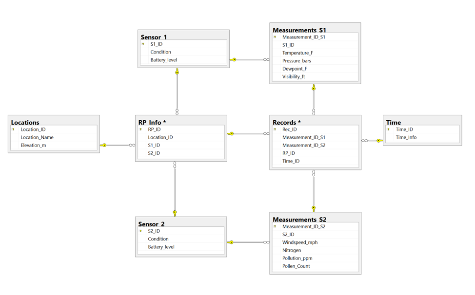
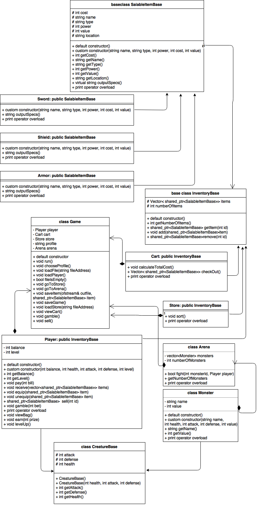
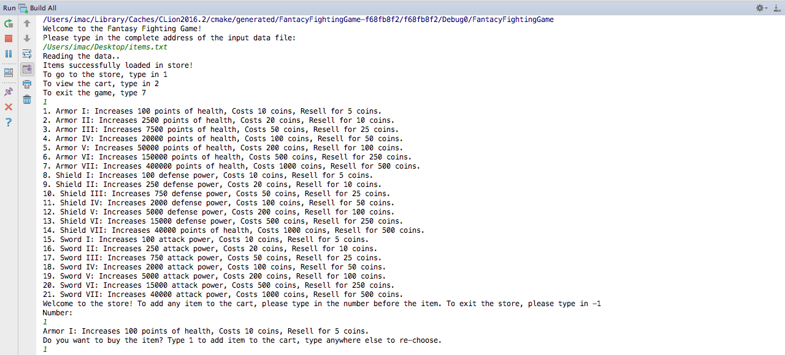

```{r setup, include=FALSE}
knitr::opts_chunk$set(echo = TRUE)
```

# Perosnal Information
School: Grand Canyon University

Degree: Bachelor Of Science In Computer Science With An Emphasis In Big Data Analytics (<a href="https://www.gcu.edu/degree-programs/bachelor-science-computer-science-big-data-analytics">program details</a>)

GPA: 3.99

Graduation Date: 04/25/2019

Email: <a href="mailto:shaunzwang@gmail.com">shaunzwang@gmail.com</a>

Github: <a href="https://github.com/shaun86wang">https://github.com/shaun86wang</a>

LinkedIn: <a href="https://www.linkedin.com/in/shaun-z-wang">https://www.linkedin.com/in/shaun-z-wang</a>

Summary: Shaun Wang is a passionate software engineer with industry software development experience, comprehensive academic education, and knowledge of various types of technologies. He has a distinct ability to learn things fast while dedicated to providing high-quality results both at work and school. He is a highly motivated and diligent self-learner. He is also a responsible leader and proactive communicator with strong interpersonal skills.

Resume: <a href="Shaun_Wang_Resume.pdf">PDF Version</a>

# Introduction
This page serves as a demonstration of projects Shaun accomplished through various classes during his pursuit of a Computer Science degree in Grand Canyon University. The sidebar presents a list of projects for simpler navigation. Different projects may be presented in different formats (websites, PDF, code snippets, etc). Keep in mind that this is not an inclusive list of all the projects throughout the course-walk. 

**Languages used by these projects include: C++, C#, JavaScript, SQL, Python, GLSL, HTML, MIPS Assembly.**

**Concepts included in these projects include: OOP, Data Structures, Algorithms, Web Development, Relational Database, Machine Learning, Computer Architecture, Operating Systems, Linear Algebra, Computer Graphics, Mathematical Modeling.**

# Machine Learning Web App
This project is an implementation of various machine learning algorithms and methods through a web app. The app includes demos for **text classification** and **image detection** using **Naive Bayes, KNN, K-means clustering, TFIDF** in **R**. 

<a href="https://shaunwang.shinyapps.io/R_Machine_Learning/">Click here for demo</a>

Program Screenshot (check demo for more)


# Virtual Memory and Process Scheduler
This project is a simulation of a **process scheduler** on top of **virtual memory**. The simulation implements both **paging and segmentation** for virtual memory. The algorithm for process scheduler is **Shortest Process Next**. The project is written in **C++**.

<a href="https://onlinegdb.com/SkBUyRDa7">Click here for code and demo</a> (you will need to click "Fork this" to be able to run the code)

<a href="process.pdf">Click here for documentation</a>

Program Screenshot (check documentation for more)


# Predator Prey Model
This project simulates predator and prey interactivity between the rabbits and foxes using, in which rabbits will act as the prey and foxes as the predator. It will be based off of the **Lotka-Volterra model**. Additionally, the model will include seasonal migration. This project is written in **Python** 

<a href="https://gist.github.com/shaun86wang/2f1e484295f7475100243b2627696a87">Click here for code gist</a>

<a href="PredatorPreyModel.pdf">Click here for documentation</a>

Program Screenshot (check documentation for more)




# WebGL Computer Graphics
This project is a 3D model of one of the GCU apartments. The project implements computer graphics concepts such as **lighting, projection, scaling, texture**, etc. Note that all the components are built from scratch *without* libraries such as three.js. The project is written in **JavaScript, GLSL, and HTML**.

<a href="apartment/apartment.html">Click here for demo</a>

<a href="https://gist.github.com/shaun86wang/c2636a33c2e229e39f69456054cd69c2">Click here for code gist</a>

Program Screenshot (check demo for more)


This project is a web bezier curve editor using similar computer graphics concepts mentioned above.

<a href="editor/editor.html">Click here for demo</a>

<a href="https://gist.github.com/shaun86wang/ffbe8a10c93c8d4602ebcba11db6009f">Click here for code gist</a>

Program Screenshot (check demo for more)


# Assembly to Binary Converter
This project converts **MIPS assembly instructions** to **binary and hex code**. The project is written in **MIPS Assembly Language**.

<a href="https://gist.github.com/shaun86wang/b605b745427e292b0ab6cdd2a15f5f13">Click here for code gist</a>

Input file

Output


# 3D Mixed Reality Simulation 
This project uses **Unity** to create a **mixed reality application** running on MS HoloLens to offer an innovative methodology for conducting an academic physics lab. This project is written in **C#**.

<a href="http://bit.ly/smurfhololens">Click here for demo</a>

# Principal Component Analysis
This project uses **Principal Component Analysis** to train the model to be able to recognize images of objects of different categories. The project is written in **Matlab**. 

<a href="https://gist.github.com/shaun86wang/34ad3c83453a8b7f1788d7faa62c0032">Click here for code gist</a>

# Data Structure Maze Solving
This project creates a maze based on an input text file. It then attempts to solve the maze depth-first using **stack**, breath-first using **queue**, or shortest-distance-next using **heap** and visualizes it through an interactive web application. This project is written in **C#, JavaScript (React)**.

<a href="https://gist.github.com/shaun86wang/4aff7debf518341f5cee6eef097eed4c">Click here for code gist</a>

<a href="https://maze-visualization.herokuapp.com">Click here for visualization demo</a>

Program Screenshot (check demo for more)


# Database Design
The project is a **database design and implementation** for storing climate information of multiple locations. The design has 8 tables. Database concepts such as **constraints, index, view, transaction, stored procedure, cursor, trigger** are implemented as well.

<a href="SMURF.pdf">Click here for documentation</a>

Design Diagram (check documentation for more)


# Object Oriented Programming
This project is a Fantasy Fighting Arena that allow players to purchase goods and fight battles. It demonstrates concepts such as **Object-Oriented Programming, Inheritance, Polymorphism, and File/IO **. This project is written in **C++**.

<a href="https://gist.github.com/shaun86wang/a6d0b6a829a9f8e729b90ab6c6296024">Click here for code gist</a>

Class Diagram


Program Screenshot (check documentation for more)

	